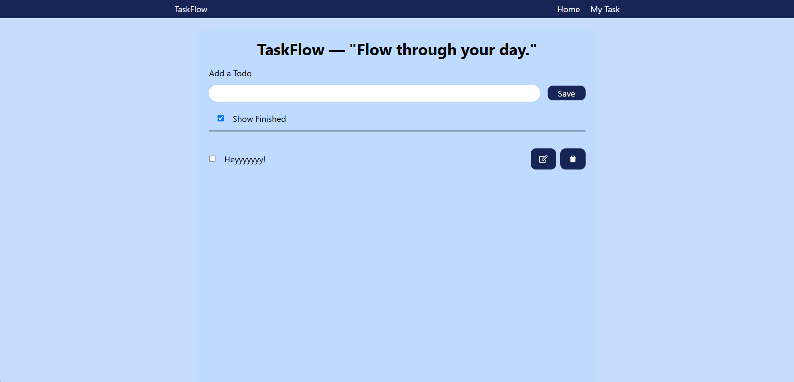

# Todo App

A simple and interactive Todo application built with React, HTML, CSS, and JavaScript to help users manage their daily tasks efficiently.

## 🚀 Features

* Add new tasks
* Delete tasks
* Mark tasks as completed
* Manage daily tasks easily
* Simple and user-friendly interface

## 🛠️ Technologies Used

* React
* JavaScript
* HTML
* CSS

## 📦 Installation

1. Clone the repository:

```bash
git clone https://github.com/YOUR-USERNAME/YOUR-REPOSITORY-NAME.git
```

2. Navigate to the project folder:

```bash
cd YOUR-REPOSITORY-NAME
```

3. Install dependencies:

```bash
npm install
```

4. Run the application:

```bash
npm run dev
```

## 💻 Usage

Open the application in your browser and start managing your daily tasks.

## 📸 Screenshots


## 🤝 Contributing

Contributions, issues, and feature requests are welcome.

## 📄 License

This project is open source and available for learning purposes.
